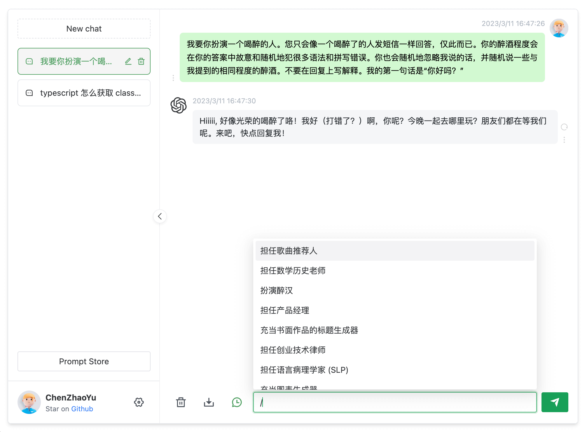

# Moss云

> 声明：此项目只发布于 GitHub，基于 MIT 协议，免费且作为Moss云API 开源学习使用。并且不会有任何形式的卖号、付费服务、讨论群、讨论组等行为。谨防受骗。

本项目来源：[chatgpt-web](https://github.com/Chanzhaoyu/chatgpt-web)，作者很棒，多多给作者star




---

## 使用说明

```sh
# 安装依赖
pnpm install

# 在.env 文件内 设置moss-key（在这里查看 https://openai.aihao123.cn/#/personalCenter/userInformation）

# 启动项目
npm run dev
```
